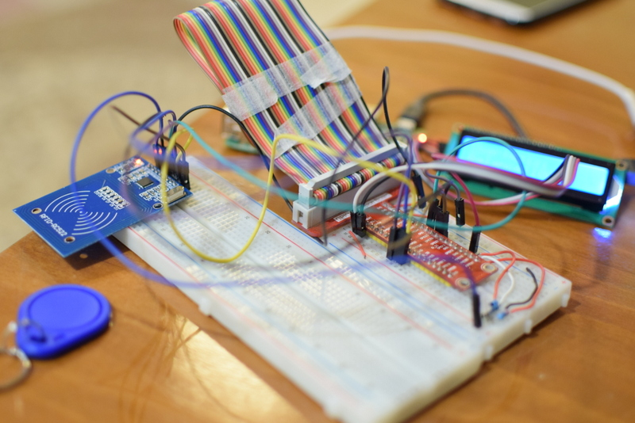

# show card balance with Raspberry pi 
In this project, I tried to design a system to show card Balance with Raspberry pi and RFID RC522 , I2C Display.
when rfid reader recognize a card, it return card tag id, with this tag id then we select related Balance from Db.
These pictures were taken from this project.
 
 

 

